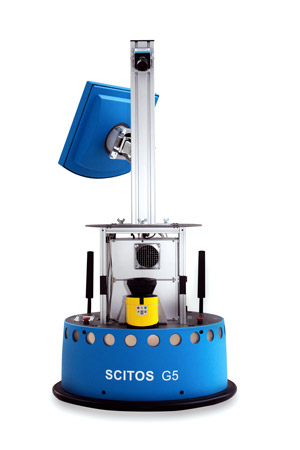

# Proyecto

## 📚 Bases de datos

Considerando el área de interes se recopilan algunas bases de datos relacionadas con robótica, control e interacción humano-robot. En esta ultima se consideran bases de datos que permitan determinar localización o reconocer actividades realizadas por los humanos.

### UC Irvine Machine Learning Repository
* [Mobile Robots Data Set](https://archive.ics.uci.edu/ml/datasets/Mobile+Robots)

* [Servo Data Set](https://archive.ics.uci.edu/ml/datasets/Servo)

* [Pioneer-1 Mobile Robot Data Data Set](https://archive.ics.uci.edu/ml/datasets/Pioneer-1+Mobile+Robot+Data)

* [Robot Execution Failures Data Set](https://archive.ics.uci.edu/ml/datasets/Robot+Execution+Failures)

* [Activities of Daily Living (ADLs) Recognition Using Binary Sensors Data Set](https://archive.ics.uci.edu/ml/datasets/Activities+of+Daily+Living+%28ADLs%29+Recognition+Using+Binary+Sensors)

* [ElectricityLoadDiagrams20112014 Data Set](https://archive.ics.uci.edu/ml/datasets/ElectricityLoadDiagrams20112014)

* [Gas sensors for home activity monitoring Data Set](https://archive.ics.uci.edu/ml/datasets/Gas+sensors+for+home+activity+monitoring)

* [Wireless Indoor Localization Data Set](https://archive.ics.uci.edu/ml/datasets/Wireless+Indoor+Localization)

* [Human Activity Recognition from Continuous Ambient Sensor Data Data Set](https://archive.ics.uci.edu/ml/datasets/Human+Activity+Recognition+from+Continuous+Ambient+Sensor+Data)

* [Synchronous Machine Data Set Data Set](https://archive.ics.uci.edu/ml/datasets/Synchronous+Machine+Data+Set)

* [Activities of Daily Living (ADLs) Recognition Using Binary Sensors Data Set](https://archive.ics.uci.edu/ml/datasets/Activities+of+Daily+Living+%28ADLs%29+Recognition+Using+Binary+Sensors)

### Kaggle datasets

* :wave: [Sensor readings from a wall-following robot](https://www.kaggle.com/uciml/wall-following-robot)

* [Cooperative robot collision/current dataset](https://www.kaggle.com/intema/cooperative-robot-collisioncurrent-dataset)

### Amazon’s AWS datasets

* [Yale-CMU-Berkeley (YCB) Object and Model Set](https://registry.opendata.aws/ycb-benchmarks/)

---
<!-- # Sensor readings from a wall-following robot -->
## Datos de sensores de un robot siguendo la pared

El conjunto de datos sobre el que se va a trabajar el proyecto es [Sensor readings from a wall-following robot](https://www.kaggle.com/uciml/wall-following-robot). 

 <!-- The data were collected as the SCITOS G5 robot navigates through the room following the wall in a clockwise direction, for 4 rounds, using 24 ultrasound sensors arranged circularly around its 'waist'. -->

Los [datos](https://www.kaggle.com/uciml/wall-following-robot) se toman de los sensores del robot SCITOS G5, cuando este navega una habitación siguiendo una pared en dirección de las manecillas del reloj. Se hacen 4 pasadas, usando los 24 sensores de ultrasonido arreglados circularmente en el contorno del chasis del robot.

<!-- Dado que los datos son series de tiempo, se busca tratar cada instancia independiente -->

### Detalles de los datos

El conjunto de datos se construye de la medición de los 24 sensores instalados en el robot. los cuales estan ubicados cada $15^0$ entre sensores adyacentes;  así como también la dirección de movimiento del robot en cada muestra. La dirección  de movimiento se divide en 4 clases: hacia adelante (**move forward**), giro a la derecha leve (**slight right-turn**), giro brusco a la derecha (**sharp right-turn**) y giro a la izquierda leve (**slight left-turn**). 

Los datos se recolectaron con una taza de 9 muestras por segundo, para un total de $5456$ muestras.

Los datos además de las medidas de los 24 sensores, también presenta dos versiones simplificadas de los datos, una con 4 sensores y otra con 2 sensores.

La version de 4 sensores se construye apartir de los 24 sensores, tomando la lectura del sensor con distancia minima en un arco de 60 grados para cada dirección, frente, izquierda, derecha y trasera del robot. La version de 2 sensores se construye a partir de la version de 4, incluyendo solo el sensor de la izquierda y el frente.

<!-- Mas sensores puede incorporar mas ruido,  -->
<!-- Slight right -> meaning that the road changes directly slightly, perhaps less than 15 degrees, and you should follow the road to the right. -->

### Datos

|Atributo | Descripción |
|--------------|-------------|
|_sd_front_ | Medida distancia mínima sensor frente, (float64) |
|_sd_left_ | Medida distancia mínima sensor izquierda, (float64)|
|_sd_right_ |Medida distancia mínima sensor derecha (float64) |
|_sd_back_ | Medida distancia mínima sensor trasera, (float64)|
|_target_ | Cuatro clases: **move forward**, **slight right-turn**, **sharp right-turn**, **slight left-turn**, (object)|

> No hay datos nulos.

---

## 📝 Contenido del repositorio

|  Jupyter Notebooks  |        Descripción         |
|------------|----------------------------|
|[P01-Preproceso.ipynb](P01-Preproceso.ipynb) | Notebook con carga de datos, exploración de los datos y preproceso para el desarrollo de los modelos |
|[P02-RegresionSimpleLogistica.ipynb](P02-RegresionSimpleLogistica.ipynb)| Se aplica una regresion simple logística donde se quiere clasificar solo una clase, **move forward**, primero con una sola característica (_sd_front_ ) y luego incluyendo las cuatro características (atributos) disponibles|
|[P03-RegresionMultivariableLogistica.ipynb](P03-RegresionMultivariableLogistica.ipynb)| Se aplica una regresion logística multiclase, dado que se requiere clasificar los cuatro movimientos.|
|[P03a-Multiclass-logistic-regression-using-sklearn.ipynb](P03a-Multiclass-logistic-regression-using-sklearn.ipynb)|Ejemplo tomado de [towarddatascience.com](https://towardsdatascience.com/logistic-regression-using-python-sklearn-numpy-mnist-handwriting-recognition-matplotlib-a6b31e2b166a). Donde se presenta un ejemplo de clasificación (regresión logística) multiclase con scikit-learn|
|[P04-Arboles.ipynb](P04-Arboles.ipynb)|Se construye un modelo de arbol de clasificación con scikit-learn|
|[P05-neuralnetworks.ipynb](P05-neuralnetworks.ipynb)| Se contruye un perceptron multicapa con scikit-learn|

---

## 📝 Resultados

